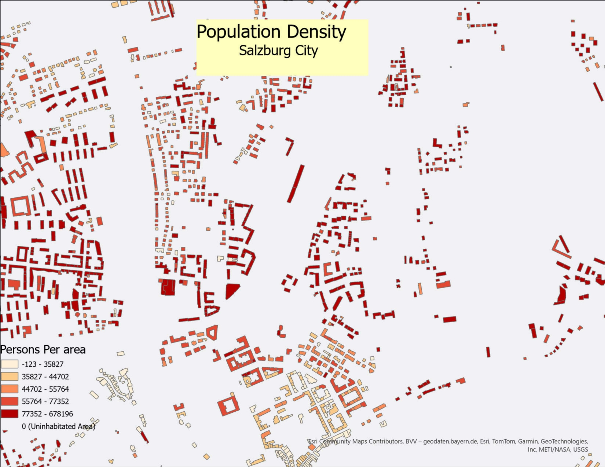

----
----
# Dasymetric-Mapping-for-Detailed-Population-Distribution-in-Salzburg-City-

This project applies dasymetric mapping to redistribute Salzburg’s district-level population data into a high-resolution, building-level population map. Using a limiting variable method and combining building footprints, DSM–DEM-derived heights, and volume-based weighting, the study produces an accurate representation of where people actually live within the city.

**Objective**

To generate a detailed, building-level population distribution map for Salzburg by refining coarse census data using spatial and physical building characteristics.

**Data Sources**

District population data – Stadt Salzburg municipal datasets

Building footprints – OpenStreetMap (clipped to city boundary)

DSM & DEM elevation models – data.gv.at (used to compute building heights)

**Methodology Overview**
**1.Data Preparation**

Reprojected and cleaned all datasets

Filtered residential buildings only

Joined district population to district polygons

**2.Building Characteristics Extraction**

Height = DSM − DEM (via Raster Calculator)

Area = footprint area (m²)

Volume = area × height (proxy for residential capacity)

Zonal Statistics used to extract building-level height values

**3.Population Redistribution**

Population allocated proportionally to each building:
Building_Population =
( Volume_i / Total_Volume_District ) * Population_District

This ensures:

realistic distribution based on building capacity

preservation of original district population totals

**4. Validation**

Summed building-level populations per district

Compared against official census values

Results showed near-perfect consistency

**Output**

Building-level population estimates

Building-level population density

Citywide dasymetric population map (visualized in GIS)

**Key Contributions**

Moves beyond uniform areal weighting

Uses building volume to approximate residential capacity

Produces actionable urban-scale population estimates

Fully consistent with district census totals

**Future Improvements**

Incorporate building usage and household-size data

Use real occupancy datasets where available

Include socio-economic indicators or land-use refinement

**Conclusion**

This project demonstrates how combining elevation data, building footprints, and dasymetric mapping techniques can significantly improve the spatial accuracy of population distribution. The resulting building-level map is valuable for urban planning, disaster management, environmental modeling, and broader spatial analysis. Although applied to Salzburg, the workflow is easily adaptable to other cities with similar data.

